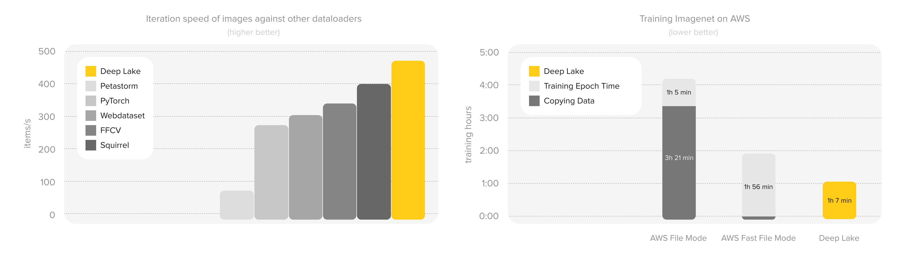

<p align="center">
     
</h1>

</br>

<h1 align="center">Deep Lake: Database for AI</h1>

<p align="center">
    <a href="https://github.com/activeloopai/deeplake/actions/workflows/test-pr-on-label.yml"></a>
    <a href="https://pypi.org/project/deeplake/"></a>
    <a href='https://docs.deeplake.ai/en/latest/?badge=latest'>
     
     </a>
    <a href="https://pepy.tech/project/deeplake"></a>
     <a href="https://github.com/activeloopai/deeplake/issues">
     </a>
    <a href="https://codecov.io/gh/activeloopai/deeplake/branch/main"></a>
  <h3 align="center">
   <a href="https://docs.activeloop.ai/?utm_source=github&utm_medium=github&utm_campaign=github_readme&utm_id=readme"><b>Docs</b></a> &bull;
   <a href="https://docs.activeloop.ai/getting-started/?utm_source=github&utm_medium=github&utm_campaign=github_readme&utm_id=readme"><b>Get Started</b></a> &bull;
   <a href="https://docs.deeplake.ai/?utm_source=github&utm_medium=github&utm_campaign=github_readme&utm_id=readme"><b>API Reference</b></a> &bull;  
   <a href="http://learn.activeloop.ai"><b>LangChain & VectorDBs Course</b></a> &bull;
   <a href="https://www.activeloop.ai/resources/?utm_source=github&utm_medium=github&utm_campaign=github_readme&utm_id=readme"><b>Blog</b></a> &bull;
   <a href="https://www.deeplake.ai/?utm_source=github&utm_medium=github&utm_campaign=github_readme&utm_id=readme"><b>Whitepaper</b></a> &bull;  
  <a href="http://slack.activeloop.ai"><b>Slack</b></a> &bull;
  <a href="https://twitter.com/intent/tweet?url=https%3A%2F%2Factiveloop.ai%2F&via=activeloopai&text=Deep%20Lake%20is%20the%20Database%20for%20all%20AI%20data.%20Check%20it%20out%21&hashtags=DeepLake%2Cactiveloop%2Copensource"><b>Twitter</b></a>
 </h3>

*Read this in other languages: [简体中文](README.zh-cn.md)*

## What is Deep Lake?

Deep Lake is a Database for AI powered by a storage format optimized for deep-learning applications. Deep Lake can be used for:

1. Storing data and vectors while building LLM applications
2. Managing datasets while training deep learning models
   
Deep Lake simplifies the deployment of enterprise-grade LLM-based products by offering storage for all data types (embeddings, audio, text, videos, images, pdfs, annotations, etc.), querying and vector search, data streaming while training models at scale, data versioning and lineage, and integrations with popular tools such as LangChain, LlamaIndex, Weights & Biases, and many more. Deep Lake works with data of any size, it is serverless, and it enables you to store all of your data in your own cloud and in one place. Deep Lake is used by Intel, Airbus, Matterport, ZERO Systems, Red Cross, Yale, & Oxford. 

### Deep Lake includes the following features:

<details>
  <summary><b>Multi-Cloud Support (S3, GCP, Azure)</b></summary>
Use one API to upload, download, and stream datasets to/from S3, Azure, GCP, Activeloop cloud, local storage, or in-memory storage. Compatible with any S3-compatible storage such as MinIO. 
</details>
<details>
  <summary><b>Native Compression with Lazy NumPy-like Indexing</b></summary>
Store images, audio, and videos in their native compression. Slice, index, iterate, and interact with your data like a collection of NumPy arrays in your system's memory. Deep Lake lazily loads data only when needed, e.g., when training a model or running queries.
</details>
<details>
  <summary><b>Dataset Version Control</b></summary>
Commits, branches, checkout - Concepts you are already familiar with in your code repositories can now be applied to your datasets as well!
</details>
<details>
  <summary><b>Dataloaders for Popular Deep Learning Frameworks</b></summary>
Deep Lake comes with built-in dataloaders for Pytorch and TensorFlow. Train your model with a few lines of code - we even take care of dataset shuffling. :)
</details>
<details>
  <summary><b>Integrations with Powerful Tools</b></summary>
Deep Lake has integrations with <a href="https://github.com/hwchase17/langchain">Langchain</a> and <a href="https://github.com/jerryjliu/llama_index">LLamaIndex</a> as a vector store for LLM apps, <a href="https://wandb.ai/">Weights & Biases</a> for data lineage during model training, and <a href="https://github.com/open-mmlab/mmdetection">MMDetection</a> for training object detection models.
</details>
<details>
  <summary><b>100+ most-popular image, video, and audio datasets available in seconds</b></summary>
Deep Lake community has uploaded <a href="https://app.activeloop.ai/datasets/activeloop?utm_source=github&utm_medium=github&utm_campaign=github_readme&utm_id=readme">100+ image, video and audio datasets</a> like <a href="https://app.activeloop.ai/activeloop/mnist-train?utm_source=github&utm_medium=github&utm_campaign=github_readme&utm_id=readme">MNIST</a>, <a href="https://app.activeloop.ai/activeloop/coco-train?utm_source=github&utm_medium=github&utm_campaign=github_readme&utm_id=readme">COCO</a>,  <a href="https://app.activeloop.ai/activeloop/imagenet-train?utm_source=github&utm_medium=github&utm_campaign=github_readme&utm_id=readme">ImageNet</a>,  <a href="https://app.activeloop.ai/activeloop/cifar100-test?utm_source=github&utm_medium=github&utm_campaign=github_readme&utm_id=readme">CIFAR</a>,  <a href="https://app.activeloop.ai/activeloop/gtzan-genre?utm_source=github&utm_medium=github&utm_campaign=github_readme&utm_id=readme">GTZAN</a> and others.
</details>
</details>
<details>
  <summary><b>Instant Visualization Support in the <a href="https://app.activeloop.ai/?utm_source=github&utm_medium=github&utm_campaign=github_readme&utm_id=readme">Deep Lake App</a></b></summary>
Deep Lake datasets are instantly visualized with bounding boxes, masks, annotations, etc. in <a href="https://app.activeloop.ai/?utm_source=github&utm_medium=github&utm_campaign=github_readme&utm_id=readme">Deep Lake Visualizer</a> (see below).
</details>

[](https://www.youtube.com/watch?v=SxsofpSIw3k)

## 🚀 Performance

Deep Lake's efficient enterprise dataloaders built in C++ speeds up data streaming by >2x compared to Hub 2.x (Ofeidis et al. 2022, Hambardzumyan et al. 2023)

<div align="center">
<a href="https://arxiv.org/pdf/2209.10785.pdf"></a>
</div>


## 🚀 How to install Deep Lake
Deep Lake can be installed using pip:
```sh
pip3 install deeplake
```
Optimized C++ implementations of Deep Lake's query engine and dataloaders can be installed using: 
```sh
pip3 install "deeplake[enterprise]"
```
**By default, Deep Lake does not install dependencies for audio, video, google-cloud, and other features. Details on all installation options are [available here](https://docs.deeplake.ai/en/latest/Installation.html).**

### To access all of Deep Lake's features, please register in the [Deep Lake App](https://app.activeloop.ai/register/).

## 🧠 Deep Lake Code Examples by Application

### Vector Store Applications
Using Deep Lake as a Vector Store for building LLM applications:
### - [Vector Store Quickstart](https://docs.activeloop.ai/quickstart)
### - [Vector Store Getting Started Guide](https://docs.activeloop.ai/getting-started/vector-store)
### - [Using Deep Lake with LangChain](https://docs.activeloop.ai/tutorials/vector-store/deep-lake-vector-store-in-langchain)
### - [Image Similarity Search with Deep Lake](https://docs.activeloop.ai/tutorials/vector-store/image-similarity-search)


### Deep Learning Applications
Using Deep Lake for managing data while training Deep Learning models:
### - [Deep Learning Quickstart](https://docs.activeloop.ai/quickstart-dl)
### - [Deep Learning Getting Started Guide](https://docs.activeloop.ai/getting-started/deep-learning)
### - [Tutorials for Training Models](https://docs.activeloop.ai/tutorials/deep-learning/training-models)
### - [Tutorials for Creating Deep Learning Datasets](https://docs.activeloop.ai/tutorials/deep-learning/creating-datasets)
### - [Deep Learning Playbooks](https://docs.activeloop.ai/playbooks/evaluating-model-performance)

## ⚙️ Integrations

Deep Lake offers integrations with other tools in order to streamline your deep learning workflows. Current integrations include:

* **Model Training**
  * Stream data while training thousands of pre-built models using [MMDetection](https://github.com/open-mmlab/mmdetection), a popular open-source object detection toolbox based on PyTorch. Learn more in [this tutorial](https://docs.activeloop.ai/tutorials/training-models/training-models-using-mmdetection).
  
* **Experiment Tracking**
  * Track experiments and achieve full model reproducibility using Deep Lake and [Weights & Biases](https://wandb.ai/). Our integration automatically pushes dataset-related information (uri, commit hash, view id) to your W&B runs. Further details are available [in our model-reproducibility playbook](https://docs.activeloop.ai/playbooks/training-reproducibility-with-wandb).
  
* **LLM Apps**
  * Use [Deep Lake as a vector store for LLM apps](https://www.activeloop.ai/resources/ultimate-guide-to-lang-chain-deep-lake-build-chat-gpt-to-answer-questions-on-your-financial-data/). Our integration combines the [Langchain](https://github.com/hwchase17/langchain) [VectorStores API](https://python.langchain.com/en/latest/reference/modules/vectorstore.html?highlight=pinecone#langchain.vectorstores.DeepLake) with Deep Lake datasets as the underlying data storage. The integration is a serverless vector store that can be deployed locally or in a cloud of your choice.

## 📚 Documentation

Getting started guides, examples, tutorials, API reference, and other useful information can be found on our [documentation page](http://docs.activeloop.ai/?utm_source=github&utm_medium=repo&utm_campaign=readme).

## 🎓 For Students and Educators
Deep Lake users can access and visualize a variety of popular datasets through a free integration with Deep Lake's App. Universities can get up to 1TB of data storage and 100,000 monthly queries on the Tensor Database for free per month. Chat in on [our website](https://activeloop.ai): to claim the access!

## 👩‍💻 Comparisons to Familiar Tools

<details>
  <summary><b>Deep Lake vs Chroma </b></summary>
  
Both Deep Lake & ChromaDB enable users to store and search vectors (embeddings) and offer integrations with LangChain and LlamaIndex. However, they are architecturally very different. ChromaDB is a Vector Database that can be deployed locally or on a server using Docker and will offer a hosted solution shortly. Deep Lake is a serverless Vector Store deployed on the user’s own cloud, locally, or in-memory. All computations run client-side, which enables users to support lightweight production apps in seconds. Unlike ChromaDB, Deep Lake’s data format can store raw data such as images, videos, and text, in addition to embeddings. ChromaDB is limited to light metadata on top of the embeddings and has no visualization. Deep Lake datasets can be visualized and version controlled. Deep Lake also has a performant dataloader for fine-tuning your Large Language Models.

</details>

<details>
  <summary><b>Deep Lake vs Pinecone</b></summary>
  
Both Deep Lake and Pinecone enable users to store and search vectors (embeddings) and offer integrations with LangChain and LlamaIndex. However, they are  architecturally very different. Pinecone is a fully-managed Vector Database that is optimized for highly demanding applications requiring a search for billions of vectors. Deep Lake is serverless. All computations run client-side, which enables users to get started in seconds. Unlike Pinecone, Deep Lake’s data format can store raw data such as images, videos, and text, in addition to embeddings. Deep Lake datasets can be visualized and version controlled. Pinecone is limited to light metadata on top of the embeddings and has no visualization. Deep Lake also has a performant dataloader for fine-tuning your Large Language Models.

</details>

<details>
  <summary><b>Deep Lake vs Weaviate</b></summary>
  
Both Deep Lake and Weaviate enable users to store and search vectors (embeddings) and offer integrations with LangChain and LlamaIndex. However, they are  architecturally very different. Weaviate is a Vector Database that can be deployed in a managed service or by the user via Kubernetes or Docker. Deep Lake is serverless. All computations run client-side, which enables users to support lightweight production apps in seconds. Unlike Weaviate, Deep Lake’s data format can store raw data such as images, videos, and text, in addition to embeddings. Deep Lake datasets can be visualized and version controlled. Weaviate is limited to light metadata on top of the embeddings and has no visualization. Deep Lake also has a performant dataloader for fine-tuning your Large Language Models.

</details>

<details>
  <summary><b>Deep Lake vs DVC</b></summary>
  
Deep Lake and DVC offer dataset version control similar to git for data, but their methods for storing data differ significantly. Deep Lake converts and stores data as chunked compressed arrays, which enables rapid streaming to ML models, whereas DVC operates on top of data stored in less efficient traditional file structures. The Deep Lake format makes dataset versioning significantly easier compared to traditional file structures by DVC when datasets are composed of many files (i.e., many images). An additional distinction is that DVC primarily uses a command-line interface, whereas Deep Lake is a Python package. Lastly, Deep Lake offers an API to easily connect datasets to ML frameworks and other common ML tools and enables instant dataset visualization through [Activeloop's visualization tool](http://app.activeloop.ai/?utm_source=github&utm_medium=repo&utm_campaign=readme).

</details>

<details>
  <summary><b>Deep Lake vs MosaicML MDS format </b></summary>
  
* **Data Storage Format:** Deep Lake operates on a columnar storage format, whereas MDS utilizes a row-wise storage approach. This fundamentally impacts how data is read, written, and organized in each system.
* **Compression:** Deep Lake offers a more flexible compression scheme, allowing control over both chunk-level and sample-level compression for each column or tensor. This feature eliminates the need for additional compressions like zstd, which would otherwise demand more CPU cycles for decompressing on top of formats like jpeg.
* **Shuffling:** MDS currently offers more advanced shuffling strategies.
* **Version Control & Visualization Support:** A notable feature of Deep Lake is its native version control and in-browser data visualization, a feature not present for MosaicML data format. This can provide significant advantages in managing, understanding, and tracking different versions of the data.

</details>

<details>
  <summary><b>Deep Lake vs TensorFlow Datasets (TFDS)</b></summary>
  
Deep Lake and TFDS seamlessly connect popular datasets to ML frameworks. Deep Lake datasets are compatible with both PyTorch and TensorFlow, whereas TFDS are only compatible with TensorFlow. A key difference between Deep Lake and TFDS is that Deep Lake datasets are designed for streaming from the cloud, whereas TFDS must be downloaded locally prior to use. As a result, with Deep Lake, one can import datasets directly from TensorFlow Datasets and stream them either to PyTorch or TensorFlow. In addition to providing access to popular publicly available datasets, Deep Lake also offers powerful tools for creating custom datasets, storing them on a variety of cloud storage providers, and collaborating with others via simple API. TFDS is primarily focused on giving the public easy access to commonly available datasets, and management of custom datasets is not the primary focus. A full comparison article can be found [here](https://www.activeloop.ai/resources/tensor-flow-tf-data-activeloop-hub-how-to-implement-your-tensor-flow-data-pipelines-with-hub/).

</details>

<details>
  <summary><b>Deep Lake vs HuggingFace</b></summary>
Deep Lake and HuggingFace offer access to popular datasets, but Deep Lake primarily focuses on computer vision, whereas HuggingFace focuses on natural language processing. HuggingFace Transforms and other computational tools for NLP are not analogous to features offered by Deep Lake.

</details>

<details>
  <summary><b>Deep Lake vs WebDatasets</b></summary>
Deep Lake and WebDatasets both offer rapid data streaming across networks. They have nearly identical steaming speeds because the underlying network requests and data structures are very similar. However, Deep Lake offers superior random access and shuffling, its simple API is in python instead of command-line, and Deep Lake enables simple indexing and modification of the dataset without having to recreate it.

</details>

<details>
  <summary><b>Deep Lake vs Zarr</b></summary>
Deep Lake and Zarr both offer storage of data as chunked arrays. However, Deep Lake is primarily designed for returning data as arrays using a simple API, rather than actually storing raw arrays (even though that's also possible). Deep Lake stores data in use-case-optimized formats, such as jpeg or png for images, or mp4 for video, and the user treats the data as if it's an array, because Deep Lake handles all the data processing in between. Deep Lake offers more flexibility for storing arrays with dynamic shape (ragged tensors), and it provides several features that are not naively available in Zarr such as version control, data streaming, and connecting data to ML Frameworks.

</details>

## Community

Join our [**Slack community**](https://join.slack.com/t/hubdb/shared_invite/zt-ivhsj8sz-GWv9c5FLBDVw8vn~sxRKqQ) to learn more about unstructured dataset management using Deep Lake and to get help from the Activeloop team and other users.

We'd love your feedback by completing our 3-minute [**survey**](https://forms.gle/rLi4w33dow6CSMcm9).

As always, thanks to our amazing contributors!

<a href="https://github.com/activeloopai/deeplake/graphs/contributors">
  
</a>

Made with [contributors-img](https://contrib.rocks).

Please read [CONTRIBUTING.md](CONTRIBUTING.md) to get started with making contributions to Deep Lake.

## README Badge

Using Deep Lake? Add a README badge to let everyone know:

[](https://github.com/activeloopai/deeplake)

```markdown
[](https://github.com/activeloopai/deeplake)
```

## Disclaimers

<details>
  <summary><b> Dataset Licenses</b></summary>
  
Deep Lake users may have access to a variety of publicly available datasets. We do not host or distribute these datasets, vouch for their quality or fairness, or claim that you have a license to use the datasets. It is your responsibility to determine whether you have permission to use the datasets under their license.

If you're a dataset owner and do not want your dataset to be included in this library, please get in touch through a [GitHub issue](https://github.com/activeloopai/deeplake/issues/new). Thank you for your contribution to the ML community!

</details>

<details>
  <summary><b> Usage Tracking</b></summary>

By default, we collect usage data using Bugout (here's the [code](https://github.com/activeloopai/deeplake/blob/853456a314b4fb5623c936c825601097b0685119/deeplake/__init__.py#L24) that does it). It does not collect user data other than anonymized IP address data, and it only logs the Deep Lake library's own actions. This helps our team understand how the tool is used and how to build features that matter to you! After you register with Activeloop, data is no longer anonymous. You can always opt-out of reporting using the CLI command below, or by setting an environmental variable ```BUGGER_OFF``` to ```True```:

```bash
activeloop reporting --off
```

</details>

## Citation

If you use Deep Lake in your research, please cite Activeloop using:

```markdown
@article{deeplake,
  title = {Deep Lake: a Lakehouse for Deep Learning},
  author = {Hambardzumyan, Sasun and Tuli, Abhinav and Ghukasyan, Levon and Rahman, Fariz and Topchyan, Hrant and Isayan, David and Harutyunyan, Mikayel and Hakobyan, Tatevik and Stranic, Ivo and Buniatyan, Davit},
  url = {https://www.cidrdb.org/cidr2023/papers/p69-buniatyan.pdf},
  booktitle={Proceedings of CIDR},
  year = {2023},
}
```

## Acknowledgment

This technology was inspired by our research work at Princeton University. We would like to thank William Silversmith @SeungLab for his awesome [cloud-volume](https://github.com/seung-lab/cloud-volume) tool.
