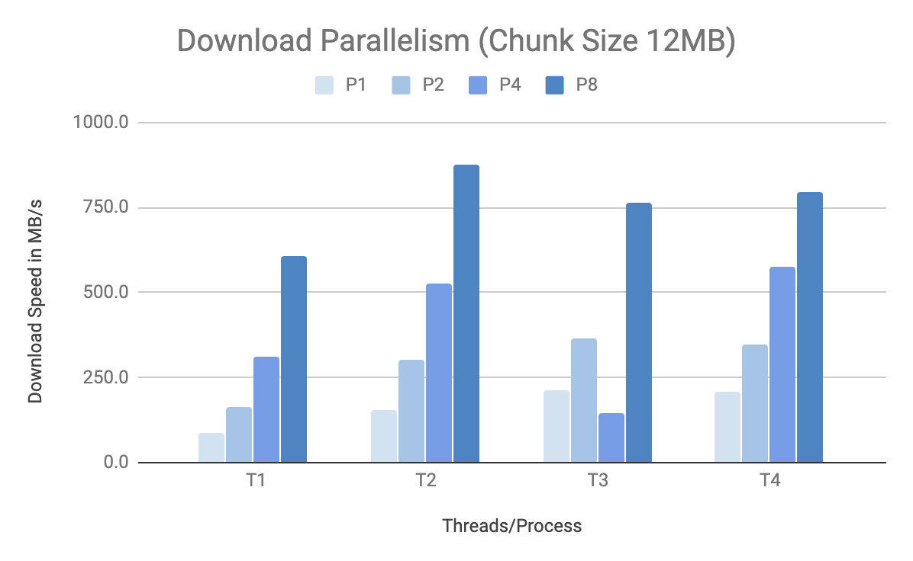
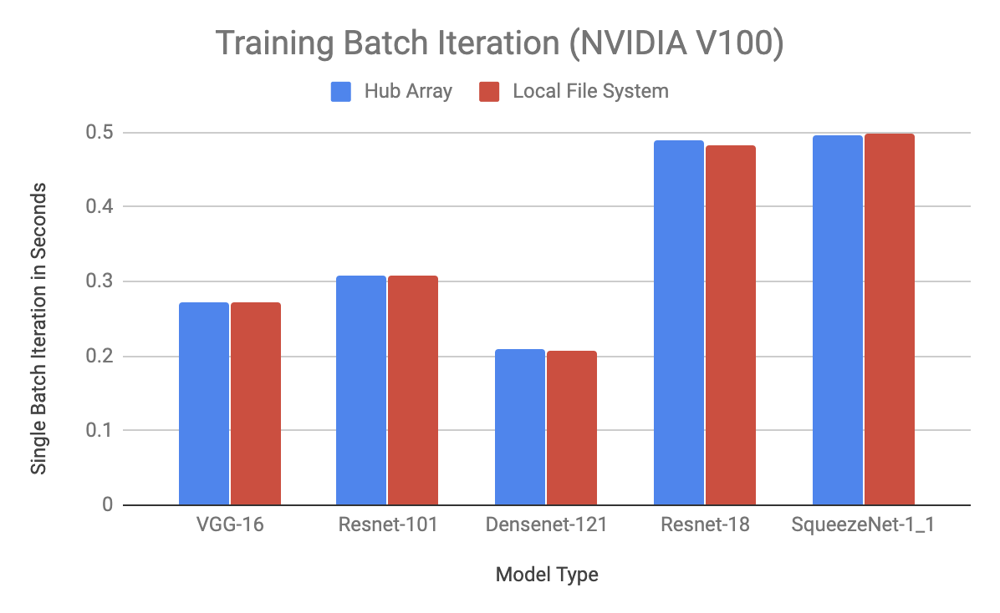

[](http://snarkhub.readthedocs.io/?badge=latest)

# Introduction
Most of the time Data Scientists/ML researchers work on data management and preprocessing instead of doing modeling. Deep Learning often requires to work with large datasets. Those datasets can grow up to terabyte or even petabyte size. It is hard to manage data, version control and track. It is time consuming to download the data and link with the training or inference code. There is no easy way to access a chunk of it and possibly visualize. **Wouldn’t it be more convenient to have large datasets stored & version-controlled as single numpy-like array on the cloud and have access to it from any machine at scale?**

> **Hub Arrays**: scalable numpy-like arrays stored on the cloud accessible over internet as if they're local numpy arrays.

Let's see how it works in action:
```sh
pip3 install hub
```

Create a large array remotely on cloud with some parts cached locally. You can read/write from anywhere as if it's a local array!
```python
> import hub
> bigarray = hub.array((10000000000, 512, 512, 3), name="test/bigarray:v0")
```

# Problems with Current Workflows
We realized that there are a few problems related with current workflow in deep learning data management through our experience of working with deep learning companies and researchers.
1. **Data locality**. When you have local GPU servers but store the data in a secure remote data center or on the cloud, you need to plan ahead to download specific datasets to your GPU box because it takes time. Sharing preprocessed dataset from one GPU box across your team is also slow and error-prone if there're multiple preprocessing pipelines.

2. **Code dependency on local folder structure**. People use a folder structure to store images or videos. As a result, the data input pipeline has to take into consideration the raw folder structure which creates unnecessary & error-prone code dependency of the dataset folder structure.

3. **Managing preprocessing pipelines**. If you want to run some preprocessing, it would be ideal to save the preprocessed images as a local cache for training.But it’s usually hard to manage & version control the preprocessed images locally when there are multiple preprocessing pipelies and the dataset is very big.

4. **Visualization**. It's difficult to visualize the raw data or preprocessed dataset on servers.

5. **Reading a small slice of data**. Another popular way is to store in HDF5/TFRecords format and upload to a cloud bucket, but still you have to manage many chunks of HDF5/TFRecords files. If you want to read a small slice of data, it's not clear which TFRecord/HDF5 chunk you need to load. It's also inefficient to load the whole file for a small slice of data.

6. **Synchronization across team**. If multiple users modify the data, there needs to be a data versioning and synchronization protocol implemented.

7. **RAM management**. Whenever you want to create a numpy array you are worried if the numpy array is going to fit in the local RAM/disk limit.


# Workflow with Hub Arrays
Simply declare an array with the namespace inside the code and thats it. “Where and How the data is stored?” is totally abstracted away from the data scientist or machine learning engineer. **You can create a numpy array up to Petabytes scale without worrying if the array will fit into RAM or local disk.** The inner workings are like this:
1. The actual array is created on a cloud bucket (object storage) and partially cached on your local environment. The array size can easily scale to 1PB.
2. When you read/write to the array, the package automatically synchronize the change from local to cloud bucket via internet.

We’re working on simple authentication system, data management, advanced data caching & fetching, and version controls.

```python
> import hub
> import numpy as np

# Create a large array that you can read/write from anywhere.
> bigarray = hub.array((100000, 512, 512, 3), name="test/bigarray:v0")

# Writing to one slice of the array. Automatically syncs to cloud.
> image = np.random.random((512,512,3))
> bigarray[0, :,:, :] = image

# Lazy-Load an existing array from cloud without really downloading the entries
> imagenet = hub.load(name='imagenet')
> imagenet.shape
(1034908, 469, 387, 3)

# Download the entries from cloud to local on demand.
> imagenet[0,:,:,:].mean()
```

## Usage
**Step 1.** Install
```sh
pip3 install hub
```

**Step 2.** Lazy-load a public dataset, and fetch a single image with up to 50MB/s speed and plot
```python
> import hub
> imagenet = hub.load(name='imagenet')
> imagenet.shape
(1034908, 469, 387, 3)

> import matplotlib.pyplot as plt
> plt.imshow(imagenet[0])
```

**Step 3.** Compute the mean and standard deviation of any chunk of the full dataset
```python
> imagenet[0:10,100:200,100:200].mean()
0.132
> imagenet[0:10,100:200,100:200].std()
0.005
```

**Step 4.** Create your own array and access it from another machine
```python
# Create on one machine
> import numpy as np
> mnist = hub.array((50000,28,28,1), name="name/random_name:v1")
> mnist[0,:,:,:] = np.random.random((1,28,28,1))

# Access it from another machine
> mnist = hub.load(name='name/random_name:v1')
> print(mnist[0])
```


## Features
* **Data Management**: Storing large datasets with version control
* **Collaboration**: Multiple data scientists working on the same data in sync
* **Distribute**: Accessing from multiple machines at the same time
* **Machine Learning**: Native integration with Numpy, Dask, PyTorch or TensorFlow.
* **Scale**: Create as big arrays as you want
* **Visualization**: Visualize the data without trouble

## Benchmarking

For full reproducibility please refer to the [code](/test/benchmark)

### Download Parallelism

The following chart shows that hub on a single machine (aws p3.2xlarge) can achieve up to 875 MB/s download speed with multithreading and multiprocessing enabled. Choosing the chunk size plays a role in reaching maximum speed up. The bellow chart shows the tradeoff using different number of threads and processes.




### Training Deep Learning Model 

The following benchmark shows that streaming data through Hub package while training deep learning model is equivalent to reading data from local file system. The benchmarks have been produced on AWS using p3.2xlarge machine with V100 GPU. The data is stored on S3 within the same region. In the asynchronous data loading figure, first three models (VGG, Resnet101 and DenseNet) have no data bottleneck. Basically the processing time is greater than loading the data in the background. However for more lightweight models such as Resnet18 or SqueezeNet, training is bottlenecked on reading speed. Number of parallel workers for reading the data has been chosen to be the same. The batch size was chosen smaller for large models to fit in the GPU RAM.  

Training Deep Learning          |  Data Streaming
:-------------------------:|:-------------------------:
  |   

## Use Cases
* **Aerial images**: Satellite and drone imagery
* **Medical Images**: Volumetric images such as MRI or Xray
* **Self-Driving Cars**: Radar, 3D LIDAR, Point Cloud, Semantic Segmentation, Video Objects
* **Retail**: Self-checkout datasets
* **Media**: Images, Video, Audio storage

### Acknowledgement
Acknowledgment: This technology was inspired from our experience at Princeton University at SeungLab and would like to thank William Silversmith @SeungLab and his awesome project [cloud-volume](https://github.com/seung-lab/cloud-volume).
