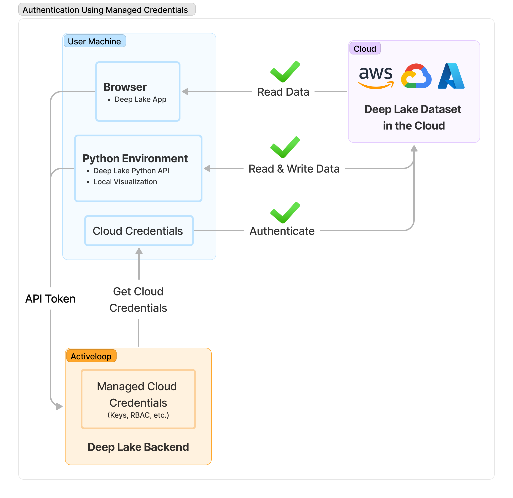

# Storage and Credentials

How to access datasets in other clouds and manage their credentials.

## Storing Datasets in Your Own Cloud

Deep Lake can be used as a pure OSS package without any registration or relationship with Activeloop. However, registering with Activeloop offers several benefits:

- Storage provided by Activeloop
- Access to [Deep Lake App](https://app.activeloop.ai), which provides dataset visualization, querying, version control UI, dataset analytics, and other powerful features
- [Managed credentials](managed-credentials/index.md) for Deep Lake datasets stored outside of Activeloop

!!! tip

    When connecting data from your cloud using Managed Credentials, the data is never stored or cached in Deep Lake. All Deep Lake user interfaces (browser, python, etc.) fetch data directly from long-term storage.

## Next Steps

- [Storage Options](storage-options.md)
- [Configuring Managed Credentials](managed-credentials/index.md)