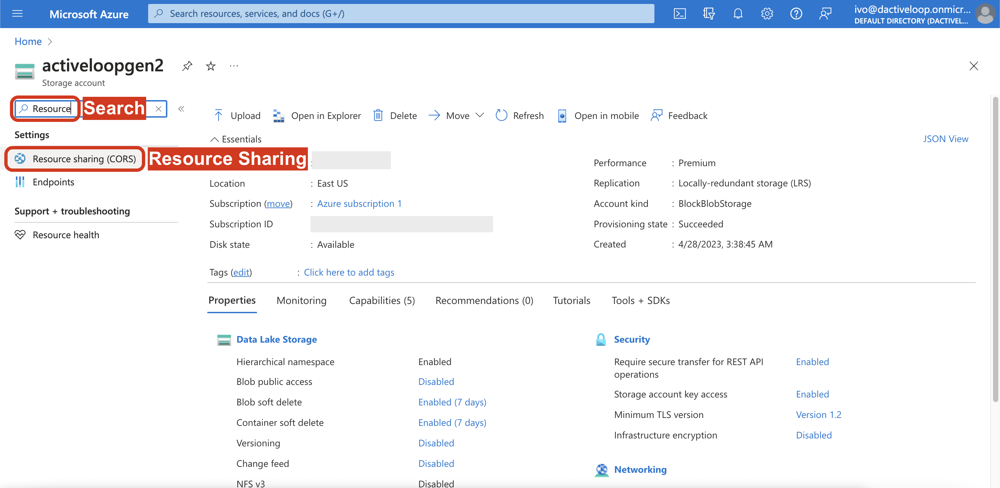

# Enabling CORS in Azure

Cross-Origin Resource Sharing (CORS) is typically enabled by default in Azure. If that's not the case in your Azure account, please enable [CORS](https://en.wikipedia.org/wiki/Cross-origin\_resource\_sharing) in order to use the [Deep Lake app](https://app.activeloop.ai/) to visualize Deep Lake datasets stored in your own Azure storage. [CORS](https://en.wikipedia.org/wiki/Cross-origin\_resource\_sharing) should be enabled in the storage account containing the Deep Lake dataset and any linked data.

## Steps for enabling CORS in Azure

1\. Login to the Azure.

2\. Navigate to the `Storage account` with the relevant data.

3\. Open the `Resource sharing (CORS)` section on the left nav.

<figure><figcaption></figcaption></figure>

4\. Add the following items to the permissions.

<figure><figcaption></figcaption></figure>

| Allowed origins           | Allowed methods | Allowed headers |
| ------------------------- | --------------- | --------------- |
| https://app.activeloop.ai | GET, HEAD       | \*              |

## Next Steps

- [Provisioning Federated Credentials](provisioning.md)