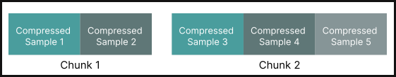
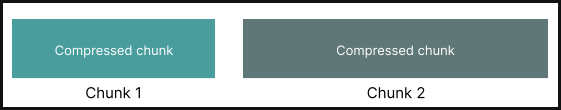

Compressions
============

.. currentmodule:: deeplake

Deep Lake can read, compress, decompress and recompress data to different formats. The supported htype-compression configurations
are given below.

+----------------+----------------+----------------------------------------+
| Sample Type    | Htype          | Compressions                           |
+================+================+========================================+
| Image          | image          | | ``bmp``, ``dib``, ``gif``, ``ico``,  |
|                |                | | ``jpeg``, ``jpeg2000``, ``pcx``,     |
|                |                | | ``png``, ``ppm``, ``sgi``, ``tga``,  |
|                |                | | ``tiff``, ``webp``, ``wmf``, ``xbm``,|
|                |                | | ``eps``, ``fli``, ``im``, ``msp``,   |
|                |                | | ``mpo``, ``apng``                    |
+----------------+----------------+----------------------------------------+
| Video          | video          | ``mp4``, ``mkv``, ``avi``              |
+----------------+----------------+----------------------------------------+
| Audio          | audio          | ``flac``, ``mp3``, ``wav``             |
+----------------+----------------+----------------------------------------+
| Dicom          | dicom          | ``dcm``                                |
+----------------+----------------+----------------------------------------+
| Point Cloud    | point_cloud    | ``las``                                |
+----------------+----------------+----------------------------------------+
| Mesh           | mesh           | ``ply``                                |
+----------------+----------------+----------------------------------------+
| Other          | bbox, text,    | ``lz4``                                |
|                | list, json,    |                                        |
|                | generic, etc.  |                                        |
+----------------+----------------+----------------------------------------+

.. _sample_compression:

Sample Compression
~~~~~~~~~~~~~~~~~~

If sample compression is specified when :meth:`creating tensors <deeplake.core.dataset.Dataset.create_tensor>`, samples will
be compressed to the given format if possible. If given data is already compressed and matches the provided ``sample_compression``,
it will be stored as is. If left as ``None``, given samples are uncompressed.

.. note::
    For audio and video, we don't support compressing raw frames but only reading compressed audio and video data.

Examples::
    
    >>> ds.create_tensor("images", htype="image", sample_compression="jpg")

    >>> ds.create_tensor("videos", htype="video", sample_compression="mp4")

    >>> ds.create_tensor("point_clouds", htype="point_cloud", sample_compression="las")

    Structure of sample-wise compressed tensor.

.. _chunk_compression:

Chunk Compression
~~~~~~~~~~~~~~~~~

If chunk compression is specified when :meth:`creating tensors <deeplake.core.dataset.Dataset.create_tensor>`, addded samples will be
clubbed together and compressed to the given format chunk-wise. If given data is already compressed, it will be uncompressed and then
recompressed chunk-wise.

.. note::
    Chunk-wise compression is not supported for audio, video and point_cloud htypes.

Examples::

    >>> ds.create_tensor("images", htype="image", chunk_compression="jpg")

    >>> ds.create_tensor("boxes", htype="bbox", chunk_compression="lz4")

    Structure of chunk-wise compressed tensor.

.. note::
    See :meth:`deeplake.read` to learn how to read data from files and populate these tensors.
