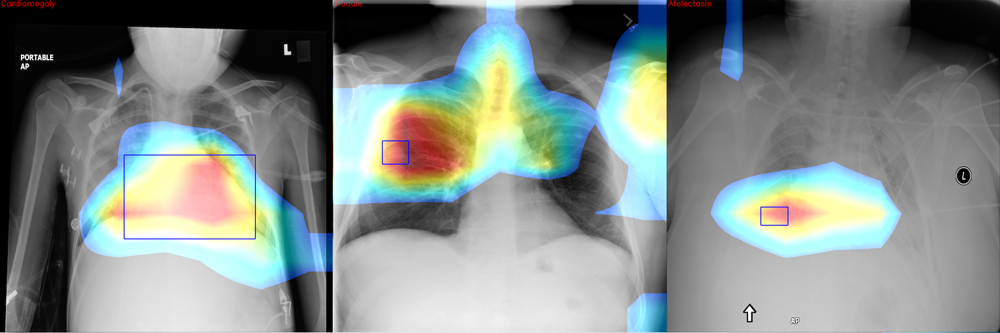

# ChexNet-Keras
This project is a tool to build CheXNet-like models, written in Keras.

## What is [CheXNet](https://arxiv.org/pdf/1711.05225.pdf)?
ChexNet is a deep learning algorithm that can detect and localize 14 kinds of diseases from chest X-ray images. As described in the paper, a 121-layer densely connected convolutional neural network is trained on ChestX-ray14 dataset, which contains 112,120 frontal view X-ray images from 30,805 unique patients. The result is so good that it surpasses the performance of practicing radiologists. If you are new to this project, [Luke Oakden-Rayner's post](https://lukeoakdenrayner.wordpress.com/2017/12/18/the-chestxray14-dataset-problems/) is highly recommended.

## TODO
1. CheXpert updates
2. Upgrade repo to TF 2.0 (tf.keras)
3. Sacred experiment management
4. Better result visualization tool
5. Model convertion/deployment tool

## In this project, you can
1. Train/test a **baseline model** by following the quickstart. You can get a model with performance close to the paper.
2. Run class activation mapping to see the localization of your model.
3. Modify `multiply` parameter in `config.ini` or design your own class weighting to see if you can get better performance.
4. Modify `weights.py` to customize your weights in loss function. If you find something useful, feel free to make that an option and fire a PR.
5. Every time you do a new experiment, make sure you modify `output_dir` in `config.ini` otherwise previous training results might be overwritten. For more options check the parameter description in `config.ini`.

## Quickstart
**Note that currently this project can only be executed in Linux and macOS. You might run into some issues in Windows.**
1. Download **all tar files**, **Data_Entry_2017.csv** and **BBox_List_2017.csv** of ChestX-ray14 dataset from [NIH dropbox](https://nihcc.app.box.com/v/ChestXray-NIHCC). Put them under `./data` folder and untar all tar files.
2. Create & source a new virtualenv. Python >= **3.6** is required.
3. Install dependencies by running `pip3 install -r requirements.txt`.
4. Copy sample_config.ini to config.ini, you may customize `batch_size` and training parameters here. Make sure config.ini is configured before you run training or testing
5. Run `python train.py` to train a new model. If you want to run the training using multiple GPUs, just prepend `CUDA_VISIBLE_DEVICES=0,1,...` to restrict the GPU devices. `nvidia-smi` command will be helpful if you don't know which device are available.
6. Run `python test.py` to evaluate your model on the test set.
7. Run `python cam.py` to generate images with class activation mapping overlay and the ground bbox. The ground truth comes from the **BBox_List_2017.csv** file so make sure you have that file in `./data` folder. CAM images will be placed under the output folder.

## Trained model weights
Many people are asking for a trained model, [there you go](https://drive.google.com/open?id=19BllaOvs2x5PLV_vlWMy4i8LapLb2j6b). I use this model to create the CAM example images. The testing mean auroc is about 82.9. Again, before you ask about comparing results with the original paper, think about how to do that in a meaningful way.

## Important notice for CUDA 9 users
If you use >= CUDA 9, make sure you set tensorflow_gpu >= 1.5.

## TODO
1. Frontend

## Acknowledgement
I would like to thank Pranav Rajpurkar (Stanford ML group) and Xinyu Weng (北京大學) for sharing their experiences on this task. Also I would like to thank Felix Yu for providing DenseNet-Keras source code.

## Author
Bruce Chou (brucechou1983@gmail.com)

## License
MIT
